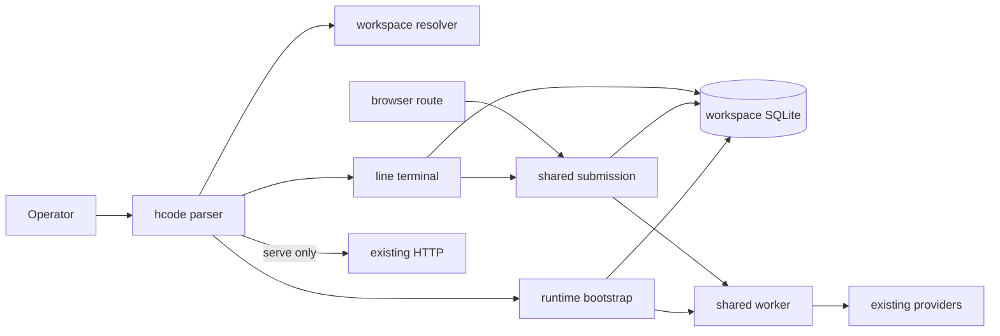

# FT-008: Design

## Design Pack

| Artifact | Relation | Direct canonical ownership | Readiness |
| --- | --- | --- | --- |
| `design.md` | `root` | All feature-local solution IDs | `status: active` |

## Selected Design

- `SOL-01` One bootstrap accepts canonical workspace, database path, optional HTTP, worker ownership, and returns idempotent shutdown.
- `SOL-02` Keep preview SQLite at `<workspace>/.hyper/_runtime/sessions`; create it only after validation.
- `SOL-03` Add a pure parser and repository-local executable `hcode`; default is terminal and `serve` alone enables HTTP.
- `SOL-04` Use a Bun-native line adapter over shared agent/session/runtime functions and ordered durable events; add no TUI dependency.
- `SOL-05` Discover Git-root-to-workspace `AGENTS.md` (workspace only outside Git) and freeze composed text into a new CLI agent prompt.
- `SOL-06` Extract browser submission scheduling into one shared operation reused by terminal and route adapters.

## Compatibility Boundary

- `CTR-05` Existing `bun 'src/$main.ts'` remains a compatibility entrypoint: it selects current cwd, existing `DB_PATH` override, and HTTP enabled. Existing browser routes and payloads do not change.
- `INV-05` This feature is a preview slice only. It cannot set runtime epoch, claim fenced ownership, or expose an `InstructionSnapshot`; those labels remain unavailable until their owning issues land.
- `FM-05` Concurrent preview processes for one workspace are unsupported and called out at launch; SQLite remains the current last-resort serialization mechanism, not an ownership proof.

### Submission and shutdown ordering

1. Resolve and validate workspace; only then create the state directory.
2. Change cwd once, load installation-root functions, connect/migrate/rehydrate.
3. Load routes only for serve mode; start the worker in both modes.
4. Terminal submission appends the user event/message, updates `next_run_at`, then calls `wakeWorker`; rendering never acknowledges completion before both `run_state=idle` and `next_run_at IS NULL`.
5. Shutdown rejects new terminal input, awaits optional HTTP graceful stop so in-flight handlers unwind while logs and SQLite remain open, then sets `workerLoopRunning=false`, aborts active agents (including shell commands), wakes the worker, waits for the owned worker promise within a bounded grace period, and closes logs/database handles.
6. A shutdown call racing another shutdown shares one stored promise; no resource is closed twice.

## C4 Applicability

| C4 ID | Decision | Reason | Artifact |
| --- | --- | --- | --- |
| `C4-01` | `C3` | Responsibilities split across CLI, workspace, bootstrap, terminal, and adapters | diagram below |

## Solution Traceability

| Requirements | Solution and architecture refs |
| --- | --- |
| `REQ-01` | `SOL-03`, `C4-01`, `SD-01`, `SD-04`, `CTR-01`, `FM-01` |
| `REQ-02` | `SOL-01`, `SOL-03`, `C4-01`, `SD-04`, `CTR-02`, `CTR-05`, `INV-01`, `FM-02`, `RB-01` |
| `REQ-03` | `SOL-01`, `SOL-02`, `C4-01`, `SD-02`, `INV-02`, `INV-03`, `INV-05`, `FM-05` |
| `REQ-04` | `SOL-05`, `C4-01`, `CTR-04`, `INV-05`, `FM-04` |
| `REQ-05` | `SOL-04`, `SOL-06`, `C4-01`, `SD-03`, `CTR-02`, `CTR-03`, `INV-04`, `FM-03` |
| `REQ-06` | `SOL-03`, `SOL-04`, `SD-01`, `INV-04`, `INV-05`, `FM-05` |

## Contracts And Invariants

- `CTR-01` Parsing yields terminal/serve mode, canonical workspace, optional model/prompt; failures have no durable/network effects.
- `CTR-02` Bootstrap returns `{ ctx, shutdown }`; shutdown first awaits optional HTTP graceful stop, then stops claims, aborts active agents, wakes/awaits the worker within a bounded grace period, and closes logs/database without deleting state.
- `CTR-03` Submission appends one operator message, schedules the existing worker immediately, and the terminal reads ordered durable events until idle.
- `CTR-04` Instruction discovery returns ordered paths and composed text; read failure is explicit before agent creation.
- `INV-01` Default terminal startup never calls `Bun.serve` or writes the port file.
- `INV-02` Source/overlay roots remain installation-anchored; file/shell cwd and state use the selected workspace.
- `INV-03` Workspace is immutable after bootstrap.
- `INV-04` Terminal renders plain text; browser-only HTML gets an explicit notice and is never executed.

## Decisions, Failures, Backout

- `SD-01` Line preview precedes any full-screen toolkit.
- `SD-02` Workspace-local state avoids premature migration.
- `SD-03` Durable events are display authority; CLI does not duplicate the marker loop.
- `SD-04` Terminal and serve are mutually exclusive foreground modes.
- `FM-01` Invalid invocation fails before bootstrap.
- `FM-02` Partial bootstrap failure cleans acquired resources without deleting state.
- `FM-03` First active `Ctrl+C` calls existing stop; repeated interrupt exits; no raw/alternate-screen mode exists.
- `FM-04` Instruction read failure names the path and prevents agent creation.
- `RB-01` Existing entrypoint delegates to bootstrap with HTTP enabled; SQLite format is unchanged, so revert leaves data readable.

## 4+1 Viewpoint Coverage Decision

| View | Stakeholders / concerns | Status | Canonical refs | Supporting projection | Reason |
| --- | --- | --- | --- | --- | --- |
| Logical | Operator/product owner; usable and honest capability | covered | brief `REQ-*`, `UC-001` | none | Always |
| Process | Runtime/reliability; ordering, races, cleanup | covered | `CTR-*`, `INV-*`, `FM-*` | Submission/shutdown sequence above | Startup/submission/shutdown change |
| Development | Maintainers; module ownership and reuse | covered | `SOL-*`, `SD-*`, `C4-01` | C3 diagram | New component responsibilities |
| Physical | Local operator; process/socket/store/config bindings | covered | `SOL-01`, `SOL-02`, `SD-04`, `RB-01` | C3 diagram | Socket/store bindings change |
| Scenarios | Operator/reviewer; end-to-end and negative behavior | covered | brief `SC-*`, `NEG-01` | Cross-view table | Always |

### Cross-View Correspondence

| Scenario | Logical | Process | Development | Physical | Verify |
| --- | --- | --- | --- | --- | --- |
| `SC-01` | `REQ-01/02/05`, `UC-001` | `CTR-01/02/03`, `FM-03` | `SOL-01/03/04/06` | `INV-01` | `CHK-01`, `EVID-01` |
| `SC-02` | `REQ-03/04` | `CTR-04`, `INV-02/03`, `FM-04` | `SOL-02/05` | `SOL-02` | `CHK-03`, `EVID-03` |
| `SC-03` | `REQ-06` | `CTR-01/02/05`, `RB-01` | `SOL-01/03` | `SD-04` | `CHK-04`, `EVID-04` |
| `NEG-01` | `REQ-01` | `FM-01/02` | `SOL-03` | `INV-01` | `CHK-02`, `EVID-02` |

## Architecture Coverage Decision

| Aspect | Status | Refs | Note |
| --- | --- | --- | --- |
| Components | covered | `SOL-*`, `C4-01` | Responsibilities are separated |
| Connectors | covered | `CTR-*` | Calls, store, wakeups, optional HTTP explicit |
| Configuration/topology | covered | `SOL-01/02`, `SD-04` | Workspace/db/socket bindings explicit |
| Behavioral semantics | covered | `INV-*`, `FM-*` | Startup, rendering, interruption explicit |
| Quality/evolution | covered | `SD-*`, `RB-01` | Reversible preview avoids schema/toolkit lock-in |

## Design Verification

| Analysis | Required | Method/result |
| --- | --- | --- |
| Alternatives | yes | Shared bootstrap beats HTTP wrapper or duplicated headless entrypoint; line adapter minimizes scope |
| Failure/recovery | yes | `FM-01`–`FM-04`, `CTR-02` cover validation, partial startup, interrupt, exit |
| Security | yes | Persistent trust warning; no containment claim or default socket |
| Migration | no | Existing path/schema retained |
| Performance | no | Single-operator preview; no new throughput claim |
| ADR | no | Feature-local reversible decisions only |
| Contract compatibility | yes | `CTR-05` preserves the existing main/browser contract; parser and route regression tests provide evidence |
| State/transition completeness | yes | Startup, submit, running/idle completion, stop, failure, and shutdown paths are enumerated in the ordering contract and `FM-*` |
| Concurrency/ordering | yes | Append-before-schedule-before-wake and stop-before-close ordering are explicit; duplicate shutdown shares one promise; concurrent workspace owners remain an explicit preview limitation `FM-05` |
