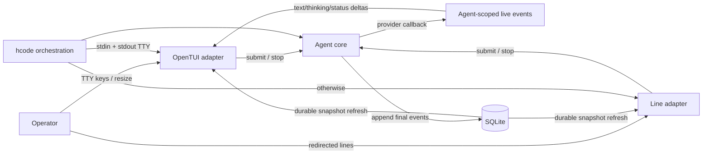

# FT-009: Design

## Design Pack

| Artifact | Relation | Direct canonical ownership | Readiness / source |
| --- | --- | --- | --- |
| `design.md` | `root` | Manifest and all feature-local `SOL-*`, `ALT-*`, `TRD-*`, `C4-*`, `SD-*`, `CTR-*`, `INV-*`, `FM-*`, `RB-*` | `status: active` |
| `../../adr/ADR-001-select-opentui-core.md` | `external-dependency` | TUI rendering/input substrate choice | `status: active`; `decision_status: accepted` |

## Context

FT-008 already separates headless runtime startup from HTTP and provides a
durable line terminal. Provider adapters already expose per-call text/thinking
deltas, but `agent.run` does not publish them to a client. Durable session events
are final authority and existing browser delivery re-reads them from SQLite.
FT-009 must add a full-screen adapter without creating a second agent loop,
changing browser semantics, or pretending that an MVP event seam closes the
complete replay/backpressure contracts in GitHub #5/#22.

## C4 Applicability

| C4 ID | Decision | Trigger / reason | Artifact |
| --- | --- | --- | --- |
| `C4-00` | `C3` | Responsibilities and callback direction change among the agent runner, in-process event seam, CLI orchestration, and terminal adapter inside one Bun process | Embedded component view below |

### C4 Component View

## 4+1 Viewpoint Coverage Decision

| View | Stakeholders / concerns | Status | Canonical owner / refs | Supporting projection | Applicability trigger / N/A evidence |
| --- | --- | --- | --- | --- | --- |
| Logical | Operator/product; usable observable coding-agent interaction | `covered` | `brief.md` `REQ-01`–`REQ-07`; `UC-001`; `DR-04` | C3 view | Observable interaction changes |
| Process | Runtime/reliability; delta/final ordering, cancel, cleanup | `covered` | `CTR-01`–`CTR-04`, `INV-01`–`INV-05`, `FM-01`–`FM-06` | C3 view | Async callbacks and terminal state transitions change |
| Development | Maintainers; runtime vs renderer responsibility | `covered` | `SOL-01`–`SOL-05`, `SD-01`–`SD-04`, ADR-001 | C3 view | Adds a renderer adapter and agent-scoped event seam |
| Physical | Operations; deployables/config/network | `N/A` | `brief.md` `CON-01`, `CON-03` | `none` | Same Bun process, SQLite store, and no-socket topology |
| Scenarios (+1) | Operator/reviewers; happy, cancel, failure, redirected paths | `covered` | `brief.md` `SC-01`–`SC-10`, `NEG-01`–`NEG-08` | C3 view | Always required |

### Cross-View Correspondence

| Scenario / requirement | Logical refs | Process refs | Development refs | Physical refs | Verification refs |
| --- | --- | --- | --- | --- | --- |
| `SC-01/02` / `REQ-01`, `REQ-06` | `UC-001`, `REQ-01`, `REQ-06` | `CTR-02`, `INV-03`, `FM-03` | `SOL-01`, `SOL-03`, `SD-02` | `N/A` | `CHK-01`, `EVID-01` |
| `SC-03/04` / `REQ-02`, `REQ-03` | `REQ-02`, `REQ-03` | `CTR-01`, `CTR-02`, `INV-01`, `INV-02`, `FM-01`, `FM-02` | `SOL-02`, `SOL-04`, `SD-01` | `N/A` | `CHK-02`, `EVID-02` |
| `SC-05` / `REQ-03` | `REQ-03` | `CTR-02` | `SOL-03`, `SOL-04` | `N/A` | `CHK-01`, `EVID-01` |
| `SC-06` / `REQ-03`, `REQ-04` | `UC-001`, `REQ-03`, `REQ-04` | `CTR-02`, `CTR-03`, `INV-02`, `INV-03` | `SOL-03`, `SOL-04`, `SD-02` | `N/A` | `CHK-01`, `CHK-03`, `EVID-01`, `EVID-03` |
| `SC-08` / `REQ-04` | `REQ-04` | `CTR-03`, `INV-03`, `FM-05` | `SOL-03` | `N/A` | `CHK-01`, `EVID-01` |
| `SC-07` / `REQ-04`, `REQ-05` | `UC-001`, `DR-04` | `CTR-03`, `INV-04`, `FM-04` | `SOL-03`, `SOL-05`, `SD-03` | `N/A` | `CHK-03`, `EVID-03` |
| `SC-09` / `REQ-04`, `REQ-05` | `REQ-04`, `REQ-05` | `CTR-03`, `INV-04` | `SOL-05`, `SD-03` | `N/A` | `CHK-03`, `EVID-03` |
| `SC-10` / `REQ-04`, `REQ-05` | `REQ-04`, `REQ-05` | `CTR-03`, `INV-04`, `FM-04` | `SOL-05`, `SD-03` | `N/A` | `CHK-03`, `EVID-03` |
| `NEG-01` / `REQ-05` | `REQ-05` | `INV-04`, `FM-03` | `SOL-05`, `SD-03` | `N/A` | `CHK-03`, `EVID-03` |
| `NEG-02` / `REQ-04`, `REQ-05` | `REQ-04`, `REQ-05` | `CTR-03`, `FM-04`, `FM-05` | `SOL-03`, `SOL-05` | `N/A` | `CHK-03`, `EVID-03` |
| `NEG-03` / `REQ-05` | `REQ-05` | `CTR-04`, `INV-04`, `FM-03` | `SOL-05`, `SD-03` | `N/A` | `CHK-03`, `EVID-03` |
| `NEG-04/05` / `REQ-05`, `REQ-07` | `REQ-05`, `REQ-07` | `INV-05`, `FM-06` | `SOL-01`, `SD-04` | `N/A` | `CHK-04`, `EVID-04` |
| `NEG-06` / `REQ-07` | `REQ-07` | `CTR-01`, `INV-01`, `INV-05` | `SOL-01`, `SOL-02` | `N/A` | `CHK-04`, `EVID-04` |
| `NEG-07` / `REQ-05` | `REQ-05` | `CTR-04`, `INV-04`, `FM-03` | `SOL-05`, `SD-03` | `N/A` | `CHK-03`, `EVID-03` |
| `NEG-08` / `REQ-05` | `REQ-05` | `CTR-03`, `INV-04`, `FM-03` | `SOL-05`, `SD-03` | `N/A` | `CHK-03`, `EVID-03` |

## Architecture Coverage Decision

| Aspect | Status | Canonical owner / refs | Supporting view / artifact | Coverage note |
| --- | --- | --- | --- | --- |
| Components / responsibilities | `covered` | `SOL-01`–`SOL-05`, `SD-01`–`SD-04`, ADR-001 | C3 view | Separates CLI selection, renderer, live events, durable reconciliation, cleanup |
| Connectors / interactions | `covered` | `CTR-01`–`CTR-04` | C3 view | Defines callback, durable refresh, input/lifecycle, and isolated adapter-failure directions |
| Configuration / topology | `covered` | `SOL-01`, `SD-04` | C3 view | TTY selects TUI; redirected operation selects line adapter; HTTP unchanged |
| Behavioral semantics | `covered` | `CTR-01`–`CTR-04`, `INV-01`–`INV-05`, `FM-01`–`FM-06` | C3 view | Covers delta/final ordering, cancellation, rendering and cleanup |
| Quality / evolution concerns | `covered` | `brief.md` `CON-01`–`CON-05`; `TRD-01`–`TRD-03`; `RB-01` | ADR-001 | Locked dependency, narrow adapter, fallback and backout |

## Selected Solution

- `SOL-01` Keep `hcode` orchestration and runtime startup unchanged in authority; select the OpenTUI adapter only when both stdin and stdout are interactive TTYs, otherwise retain the existing line adapter.
- `SOL-02` Add an agent-scoped, in-process live-event seam for typed turn lifecycle plus assistant/thinking deltas. It is callback-only, non-durable, single-process, and not exposed through the global browser/SSE bus.
- `SOL-03` Build the full-screen interface with imperative `@opentui/core`: a scrollable conversation viewport, multiline textarea, compact status line, explicit help line, and permanent trusted-mode indicator.
- `SOL-04` Reconcile presentation through two layers: ephemeral deltas update one live projection; durable session events remain final authority and replace/clear the projection as the run advances.
- `SOL-05` Own renderer lifecycle inside the TUI adapter and destroy it in `finally`; runtime shutdown remains owned by existing CLI orchestration after the adapter returns or fails.

## Alternatives Considered

| Alternative ID | Option | Why not selected |
| --- | --- | --- |
| `ALT-01` | Directly pass provider callbacks into OpenTUI | Couples UI to providers, misses marker-loop lifecycle, and creates a second runtime path |
| `ALT-02` | Publish deltas on the existing global events/SSE bus | Would expose an unversioned internal projection to browser/external subscribers and silently expand GitHub #5 scope |
| `ALT-03` | Wait for complete #5/#22/#6/#7 issue closure | Delays the accepted vertical slice behind replay, fencing, approvals, and recovery obligations not required for one local TUI |
| `ALT-04` | Render only durable events in full screen | Produces cosmetic fullscreen output but does not solve the main responsiveness problem |

## Trade-offs

| Trade-off ID | Decision | Benefit | Cost / Risk |
| --- | --- | --- | --- |
| `TRD-01` | Minimal agent-scoped callback rather than complete event infrastructure | Delivers responsive TUI without claiming broader contracts | Later #5 work may replace/extend the seam |
| `TRD-02` | Single active CLI agent | Keeps lifecycle and layout coherent | Session management remains deferred |
| `TRD-03` | OpenTUI native dependency | Reliable terminal primitives and deterministic tests | Platform artifact and upstream API risk |

## Accepted Local Decisions

- `SD-01` Live event kinds are versioned only within the FT-009 module contract and never persisted or sent over HTTP.
- `SD-02` Submission uses `Ctrl+Enter`; ordinary Enter inserts a newline. `Ctrl+C` stops an active turn and exits when idle; `Ctrl+D` exits only with an empty composer.
- `SD-03` Renderer destruction is idempotent and belongs to one `finally` boundary; signal handlers request exit but do not independently mutate terminal modes.
- `SD-04` `hcode` initial positional prompt may start the TUI turn after the first frame; redirected positional prompts continue through line mode.

## Live Event Vocabulary

Every live event has `version: 1`, `agentId`, an ephemeral process-local
`runId`, and a strictly increasing `seq` within that run. Model-call events also
have a `callId` whose ordinal is unique within the run. IDs exist only for
correlation by the attached adapter and are never stored, serialized, or reused
after process restart.

| Kind | Additional payload | Emission boundary | TUI meaning |
| --- | --- | --- | --- |
| `run_started` | none | once, immediately after `agent.run` acquires its abort controller | Reset stale live state and show running |
| `model_call_started` | `callId` | before each `llm.stream` invocation, including marker-loop continuations | Create empty thinking/assistant projections for this call |
| `thinking_delta` | `callId`, `delta` | synchronously from the matching provider callback | Append `delta` verbatim to the visibly labelled live thinking projection |
| `text_delta` | `callId`, `delta` | synchronously from the matching provider callback | Append `delta` verbatim to the labelled live assistant preview; marker protocol text may be transiently visible and is never treated as a durable tool/result |
| `model_call_finished` | `callId` | after that call's parsed durable prose/thinking/tool/error effects have been appended, immediately before return or the next marker-loop call | Refresh durable events, then remove both live projections for this call |
| `run_finished` | `outcome: completed | stopped | failed`, optional technical `reason`, optional `error` | once as `agent.run` exits; an abort maps to `stopped`, while the original abort/failure still propagates to the worker | Completed clears residual live state; stopped/failed keeps residual preview labelled until durable stop/error refresh |

Unknown versions or kinds are ignored. Empty deltas are ignored. Subscriber
callbacks observe this order synchronously, but rendering may coalesce frames
as long as concatenated delta order is unchanged.

## Reconciliation State Machine

1. The TUI subscribes before submission and records its current durable event
   offset. `run_started` begins one live run; events for any other run/call are
   ignored.
2. Deltas append only to their matching current `callId`. They never write to
   SQLite or `agent.messages/events`.
3. Durable refresh appends SQLite events in `idx` order using the same
   presentation vocabulary as line mode. A durable assistant/thinking/tool/error
   event is authoritative and is never concatenated with a live preview.
4. On `model_call_finished`, the adapter drains durable events from its offset
   and then deletes that call's live projections. A marker-bearing preview is
   therefore replaced by parsed prose/tool events, and a final answer by its
   exact durable assistant event, without duplication.
5. On failed/stopped `run_finished`, the last partial preview remains labelled
   failed/stopped until the worker appends or exposes the durable error/stop
   state; that refresh removes it. Completed outcome leaves no residual preview.
6. Resize changes layout only. Restart has no live replay and rebuilds solely
   from durable SQLite events.

## Contracts

| Contract ID | Connector / direction | Roles and sync boundary | Guarantees / failure / evolution semantics |
| --- | --- | --- | --- |
| `CTR-01` | Agent live callback: `agent.run -> agent-scoped subscribers` | Producer is run orchestration; TUI registers `{ onEvent, onError }` and receives an idempotent unsubscribe disposer | Vocabulary and ordering are defined above; `onEvent` failure cannot fail the run; publisher catches it and calls that subscriber's `onError` once; normal adapter cleanup detaches before renderer destruction; no persistence/replay/backpressure/external serialization claim |
| `CTR-02` | Durable refresh: `SQLite session events -> TUI projection` | TUI reads after append notification/poll wake and at `model_call_finished` | Durable order/final text is authoritative; the state machine clears covered live projections only after the durable drain; reconnect starts from durable snapshot |
| `CTR-03` | Input/lifecycle: `OpenTUI keys/signals -> submit/stop/exit` | TUI translates keys; core owns durable submit and stop; CLI owns runtime shutdown | One submission at a time; cancel does not acknowledge success; exit is idempotent; resize only reflows presentation |
| `CTR-04` | Adapter failure: `live subscriber -> publisher isolation -> TUI adapter` | Publisher catches a subscriber exception, removes that subscriber, and invokes its paired `onError`; TUI races this local failure signal with input/run work | Agent run continues independently; TUI stops input, unwinds its sole `finally`, invokes the idempotent unsubscribe, then destroys the renderer, and propagates the original adapter error to CLI-owned runtime shutdown |

## Invariants

- `INV-01` Live deltas never mutate durable messages/events and never become model-visible context.
- `INV-02` Completed displayed assistant/thinking text equals the durable final event and contains no duplicated live prefix.
- `INV-03` The trusted-mode warning remains visible in every interactive TUI frame.
- `INV-04` Terminal modes and cursor state are restored exactly once before adapter completion or error propagation.
- `INV-05` Non-TTY and browser behavior do not import or initialize OpenTUI rendering.

## Failure Modes

- `FM-01` Provider fails after partial deltas: retain the partial live projection as visibly failed until the durable error refresh arrives, then show the durable error.
- `FM-02` Subscriber/render callback throws: `CTR-04` isolates the callback from `agent.run` while its paired local failure signal unwinds and destroys the TUI adapter; CLI shutdown then handles remaining runtime work.
- `FM-03` Renderer setup/render fails: destroy any acquired renderer and propagate so CLI shutdown closes runtime resources.
- `FM-04` Stop races with provider completion: existing durable run state decides the outcome; TUI never synthesizes success.
- `FM-05` Resize arrives during output: reflow from current view state without resubmission or event loss.
- `FM-06` Streams are redirected or terminal capability is unavailable: use the line adapter and emit no full-screen control sequences.

## Rollout / Backout

| Stage ID | Stage | Entry condition | Backout |
| --- | --- | --- | --- |
| `RB-01` | TTY-selective default TUI | Focused frames/input/cleanup tests, PTY smoke, full suite, Ubuntu CI | Restore TTY routing to the existing line adapter and remove the OpenTUI dependency; durable schema/state is unchanged |

## Design Verification

| Analysis | Required | Reason / risk | Method | Result / evidence |
| --- | --- | --- | --- | --- |
| Contract compatibility | yes | Browser, non-TTY, durable events, and provider adapters must remain compatible | Consumer/producer matrix and scenario walk-through | `SOL-01/02/04`, `CTR-01/02`, `INV-01/05` preserve boundaries; no schema/API removal |
| State / transition completeness | yes | TUI has idle/running/stopping/exiting and live/final projection states | Scenario/state walk-through | Every state has submit/cancel/exit/final/error behavior through `CTR-01`–`CTR-04` and `FM-*` |
| Failure propagation | yes | Renderer and subscriber failure must not corrupt runtime/terminal | Failure-mode analysis | Single cleanup owner and subscriber isolation cover `FM-01`–`FM-06` |
| Concurrency / ordering | yes | Deltas race with durable append/cancel/resize | Interleaving review | Live callbacks are ordered per run; durable offset is authority; one submission gate avoids duplicate input |
| Security boundaries | yes | UI must not imply containment or expose internal events externally | Trust-boundary review | Authority unchanged; permanent warning; agent-scoped seam is not global/SSE |
| Capacity / latency | yes | High-frequency deltas can over-render | Bounded-coalescing review | Adapter may coalesce render scheduling while preserving text order; deterministic delayed/burst tests required |
| Migration / evolution safety | yes | New dependency/event seam may be replaced by later #5 work | Compatibility/backout review | No schema migration; narrow seam and TTY routing allow code-only backout |

## External Dependency Readiness

| Artifact | Publication status | Lifecycle status | Canonical source / version | Used for |
| --- | --- | --- | --- | --- |
| `../../adr/ADR-001-select-opentui-core.md` | `active` | `decision_status: accepted` | ADR-001 revision in this feature PR | Rendering/input/test substrate choice |

## Traceability

| Requirement ID | Solution refs | Contracts / invariants | Failure / rollout refs |
| --- | --- | --- | --- |
| `REQ-01`, `REQ-04`, `REQ-06` | `SOL-01`, `SOL-03`, `TRD-02`, `SD-02` | `CTR-03`, `INV-03` | `FM-03`–`FM-05`, `RB-01` |
| `REQ-02`, `REQ-03` | `SOL-02`, `SOL-04`, `TRD-01`, `SD-01` | `CTR-01`, `CTR-02`, `INV-01`, `INV-02` | `FM-01`, `FM-02`, `RB-01` |
| `REQ-05` | `SOL-01`, `SOL-05`, `SD-03`, `SD-04` | `CTR-03`, `INV-04`, `INV-05` | `FM-03`–`FM-06`, `RB-01` |
| `REQ-07` | `SOL-01`, `SOL-02`, `SOL-04` | `CTR-01`, `CTR-02`, `INV-01`, `INV-05` | `FM-02`, `FM-06`, `RB-01` |
