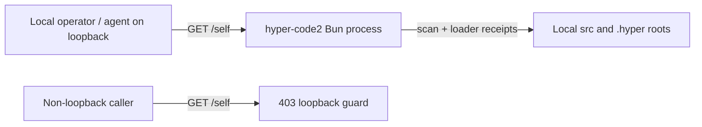

# FT-036: Design

## Design Pack

| Artifact | Relation | Direct canonical ownership | Readiness / source |
| --- | --- | --- | --- |
| `design.md` | `root` | All feature-local `SOL-*`, `TRD-*`, `C4-*`, `SD-*`, `CTR-*`, `INV-*`, `FM-*`, `RB-*` | `status: active` |

## Context

The descriptor joins live registry facts with scanner candidates and loader
receipts. A filesystem scan alone cannot prove what code is active after a hot
reload, while dumping runtime values would violate the accepted security boundary.

## C4 Applicability

| C4 ID | Decision | Trigger / reason | Artifact |
| --- | --- | --- | --- |
| `C4-01` | `C1` | The new HTTP interaction crosses the existing network-to-local-app boundary and exposes implementation metadata. | Embedded System Context below |

## 4+1 Viewpoint Coverage Decision

| View | Stakeholders / concerns | Status | Canonical owner / refs | Supporting projection | Applicability trigger / N/A evidence |
| --- | --- | --- | --- | --- | --- |
| Logical | Agent/operator; truthful inspectability | `covered` | `brief.md` `REQ-01…04`; UC-008 | none | Always |
| Process | Runtime maintainer; startup/reload ordering and freshness | `covered` | `CTR-01`, `INV-01`, `FM-01` | none | Loader writes receipts before descriptor reads them |
| Development | Maintainer; loader, descriptor and route ownership | `covered` | `SOL-01…03`, `SD-01` | none | New module and runtime metadata responsibility |
| Physical | Operator; existing listener and loopback boundary | `covered` | `SOL-03`, `CTR-01`, `INV-04` | `C4-01` | Existing process remains on `0.0.0.0`; the new route restricts callers to loopback |
| Scenarios (+1) | User/reviewer; end-to-end and negative paths | `covered` | `brief.md` `SC-01…03`, `NEG-01` | none | Always |

### Cross-View Correspondence

| Scenario / requirement | Logical refs | Process refs | Development refs | Physical refs | Verification refs |
| --- | --- | --- | --- | --- | --- |
| `SC-01` / `REQ-01` | `REQ-01` | `CTR-01` | `SOL-02`, `SOL-03` | `C4-01`, `INV-04` | `CHK-01`, `CHK-04`, `EVID-01`, `EVID-04` |
| `SC-02` / `REQ-02` | `REQ-02` | `INV-01`, `FM-01` | `SOL-01`, `SOL-02` | N/A | `CHK-02`, `EVID-02` |
| `SC-03` / `REQ-04` | `REQ-04` | `FM-02` | `SOL-02` | N/A | `CHK-02`, `EVID-02` |
| `NEG-01` / `REQ-03` | `REQ-03` | `INV-02` | `SOL-02` | N/A | `CHK-03`, `EVID-03` |

## Architecture Coverage Decision

| Aspect | Status | Canonical owner / refs | Supporting view / artifact | Coverage note |
| --- | --- | --- | --- | --- |
| Components / responsibilities | `covered` | `SOL-01…03`, `SD-01` | none | Loaders own receipts; self module owns projection; route owns transport. |
| Connectors / interactions | `covered` | `CTR-01` | none | Synchronous function call and GET JSON semantics are explicit. |
| Configuration / topology | `covered` | `C4-01`, `SOL-03`, `INV-04` | embedded C1 | Existing listener is unchanged; the route enforces loopback at request time. |
| Behavioral semantics | `covered` | `INV-01…03`, `FM-01…03` | none | Precedence, evidence and redaction behavior are explicit. |
| Quality / evolution concerns | `covered` | `TRD-01`, `RB-01` | none | Versioned schema and additive evolution rule. |

## Selected Solution

- `SOL-01` Startup and hot reload write a receipt per loaded registered function: logical name, root, relative path, SHA-256, timestamp and monotonic generation. Later roots overwrite earlier receipts, matching overlay-wins registry semantics.
- `SOL-02` `self.describe` scans source candidates and live registry names, joins them with receipts, compares current and loaded hashes, and emits a bounded schema-version-1 projection.
- `SOL-03` `GET /self` returns the `self.describe` value through the existing route/JSON response path only when the server-observed peer address is loopback; other callers receive 403 before descriptor evaluation.

## Alternatives Considered

| Alternative ID | Option | Why not selected |
| --- | --- | --- |
| `ALT-01` | Infer effective origin from current filesystem order | Cannot prove what was actually loaded after edits or direct registry mutation. |
| `ALT-02` | Dump registry, prompts, env and state | Leaks values and still lacks provenance/freshness. |
| `ALT-03` | Persist receipts in the database | Read-only baseline needs no durable schema and current-process receipts are more truthful. |

## Trade-offs

| Trade-off ID | Decision | Benefit | Cost / Risk |
| --- | --- | --- | --- |
| `TRD-01` | Compact schema and no drill-down endpoint in v1 | Predictable context and smaller leak surface | Some authorities remain explicitly `inferred` or `unavailable` |

## Accepted Local Decisions

- `SD-01` Receipts are transient process state because they describe the current loaded process; this is feature-local and does not define a reusable persistence architecture.
- `SD-02` Paths are emitted as root-relative labels (`src/...`, `.hyper/...`), never machine-specific absolute paths.

## Contracts

| Contract ID | Connector / direction | Roles and sync boundary | Guarantees / failure / evolution semantics |
| --- | --- | --- | --- |
| `CTR-01` | Function call or HTTP GET -> descriptor builder | Caller/route to `self.describe`; async request/response | JSON-safe schema v1; additive fields allowed within v1; absent evidence is `unavailable`; HTTP requires server-observed loopback peer or returns 403 and successful responses use `Cache-Control: no-store`; failures propagate as existing route errors. |

## Invariants

- `INV-01` A reported effective origin comes only from a loader receipt, never from candidate ordering.
- `INV-02` Descriptor includes identities, hashes and classifications only; no prompt, environment, credential, message, scratchpad, database or arbitrary state values.
- `INV-03` The feature exposes no mutation operation or additional authority.
- `INV-04` The HTTP surface never evaluates or returns the descriptor to a non-loopback peer.

## Failure Modes

- `FM-01` A source changes after load: report `stale`, preserving loaded and current hashes.
- `FM-02` A live function lacks a receipt: report effective origin as `unavailable`.
- `FM-03` A candidate disappears or cannot be read: report unavailable candidate freshness/hash without fabricating data.

## Rollout / Backout

| Stage ID | Stage | Entry condition | Backout |
| --- | --- | --- | --- |
| `RB-01` | Load receipts and register `/self` with normal startup | Tests and typecheck green | Revert feature commit; no migration or persisted state exists |

## Design Verification

| Analysis | Required | Reason / risk | Method | Result / evidence |
| --- | --- | --- | --- | --- |
| Contract compatibility | yes | New JSON schema | Consumer/schema review | Versioned, additive v1; no prior consumer contract |
| State / transition completeness | yes | fresh/stale/unavailable facts | Scenario walk-through | `FM-01…03` cover transitions and missing evidence |
| Failure propagation | yes | File read/scan can fail | Failure-mode review | Per-fact unavailability is bounded; route-level unexpected failure uses existing behavior |
| Concurrency / ordering | yes | Startup overlay and reload ordering | Loader-order regression | Later root wins receipt and registry |
| Security boundaries | yes | Runtime contains secrets and the server binds beyond loopback | Data-flow, peer-address guard and sentinel review | `INV-02` forbids values; `INV-04`, `NEG-01` and `NEG-02` verify non-transit and loopback-only access |
| Capacity / latency | no | Local codebase scan, manually invoked read-only endpoint | Not required | No background or hot request loop introduced |
| Migration / evolution safety | yes | Schema evolution | Compatibility review | `schemaVersion: 1`; no persistent migration |

## External Dependency Readiness

None.

## Traceability

| Requirement ID | Solution refs | Contracts / invariants | Failure / rollout refs |
| --- | --- | --- | --- |
| `REQ-01` | `SOL-02`, `SOL-03`, `SD-02` | `CTR-01`, `INV-03` | `RB-01` |
| `REQ-02` | `SOL-01`, `SOL-02`, `SD-01` | `INV-01` | `FM-01…03`, `RB-01` |
| `REQ-03` | `SOL-02`, `TRD-01` | `INV-02`, `INV-03` | `FM-03` |
| `REQ-04` | `SOL-02` | `CTR-01`, `INV-01` | `FM-01…03` |
