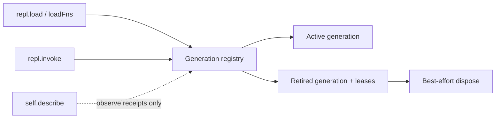

# FT-046: Design

## Design Pack

| Artifact | Relation | Direct canonical ownership | Readiness / source |
| --- | --- | --- | --- |
| `design.md` | `root` | Feature-local `SOL-*`, `SD-*`, `CTR-*`, `INV-*`, `FM-*` | Active; ADR-002 accepted |

## C4 Applicability

| C4 ID | Decision | Trigger / reason | Artifact |
| --- | --- | --- | --- |
| `C4-01` | `C4 Code` | Reusable concurrency/lifecycle primitive and managed invocation boundary require explicit object relationships; no new deployable/container is introduced. | Embedded component model below |

## 4+1 Viewpoint Coverage

| View | Status | Canonical refs | Coverage |
| --- | --- | --- | --- |
| Logical | `covered` | `REQ-01..06`, `UC-004` | Active/retired/unavailable lifecycle meanings are explicit |
| Process | `covered` | `CTR-01`, `INV-01..06`, `FM-01..04` | Stage → publish → lease → quiesce → dispose and failure paths |
| Development | `covered` | `SOL-01..04`, `ADR-002` | Loader, lifecycle state and managed invocation ownership |
| Physical | `N/A` | `C4-01` | Existing single Bun process and storage topology unchanged |
| Scenarios (+1) | `covered` | `SC-01..05`, `NEG-01..03` | Failure, fallback, concurrency and unmanaged-reference paths |

## Architecture Coverage Decision

| Aspect | Status | Refs | Coverage note |
| --- | --- | --- | --- |
| Components / responsibilities | `covered` | `SOL-01..04` | Loader publishes; lifecycle registry tracks; invoke leases; descriptor observes |
| Connectors / interactions | `covered` | `CTR-01` | Procedural call boundary and async disposal are explicit |
| Configuration / topology | `N/A` | `C4-01` | No new process, queue, store or configuration |
| Behavioral semantics | `covered` | `INV-01..06`, `FM-01..04` | Atomicity, fallback, quiescence and failure are defined |
| Quality / evolution | `covered` | `ADR-002`, `RB-01` | Direct references and security limits remain explicit |

## Selected Solution

- `SOL-01` Resolve and import a complete namespace replacement set before mutating the live registry or source receipts.
- `SOL-02` Maintain transient lifecycle records keyed by logical name and generation, with active and retired entries, lease count, disposal state and failure evidence.
- `SOL-03` Expose `ctx.fns.repl.invoke(ctx, { name, opts })` as the managed invocation boundary; it leases the generation selected at call start and releases it in `finally`.
- `SOL-04` On retirement, dispose only when lease count reaches zero; disposal is at-most-once per generation and errors are recorded without changing the active generation.

## Accepted Local Decisions

- `SD-01` Lifecycle state is transient process state; no migration or durable receipt history is added.
- `SD-02` Existing raw `ctx.fns` calls remain compatible and are explicitly unmanaged; only `repl.invoke` carries quiescence guarantees.
- `SD-03` Missing current candidates are represented as unavailable lifecycle state after reload; a base candidate is selected by existing root precedence when present.

## Contract

| Contract ID | Direction / roles | Guarantees | Failure / evolution |
| --- | --- | --- | --- |
| `CTR-01` | `repl.invoke` caller → active loaded function | Calls receive `(ctx, opts)`; one lease protects the selected generation until promise settlement; release always occurs | Unknown/unavailable name fails explicitly; function error propagates; future fields may be additive |

## Invariants

- `INV-01` A namespace reload publishes no staged function or receipt until every staged function validates source hash/version and default export.
- `INV-02` At most one active generation exists per logical name; prior active generations become retired records.
- `INV-03` A managed call increments the selected generation lease before invocation and decrements it exactly once in `finally`.
- `INV-04` A retired generation is not disposed while its lease count is non-zero.
- `INV-05` Disposal is at-most-once per retired generation; failure is recorded and does not remove the active replacement.
- `INV-06` Raw captured references do not acquire leases and are outside the lifecycle guarantee.

## Failure Modes

- `FM-01` Staging import/source race: abort before commit and preserve prior active set.
- `FM-02` Overlay removed: commit base fallback or explicit unavailable state; do not retain a removed receipt.
- `FM-03` Managed function rejects: release lease and preserve lifecycle state; caller receives the original error.
- `FM-04` Disposal rejects: record error and keep active replacement; no double-disposal on later release.

## Design Verification

| Analysis | Required | Method | Result target |
| --- | --- | --- | --- |
| Contract compatibility | yes | Existing loader/repl tests and typecheck | Existing calls continue to work; managed API is additive |
| State/transition completeness | yes | State table + scenarios | active → retired → quiescent → disposed/unavailable |
| Failure propagation | yes | Import, call and disposal rejection fixtures | No partial publication; errors remain observable |
| Concurrency/ordering | yes | Delayed module and delayed invocation fixtures | Lease prevents early disposal; stage precedes commit |
| Security boundary | yes | Boundary review | No new authority or containment claim |
| Migration/evolution | yes | Schema and process-state review | No durable migration; additive API |
